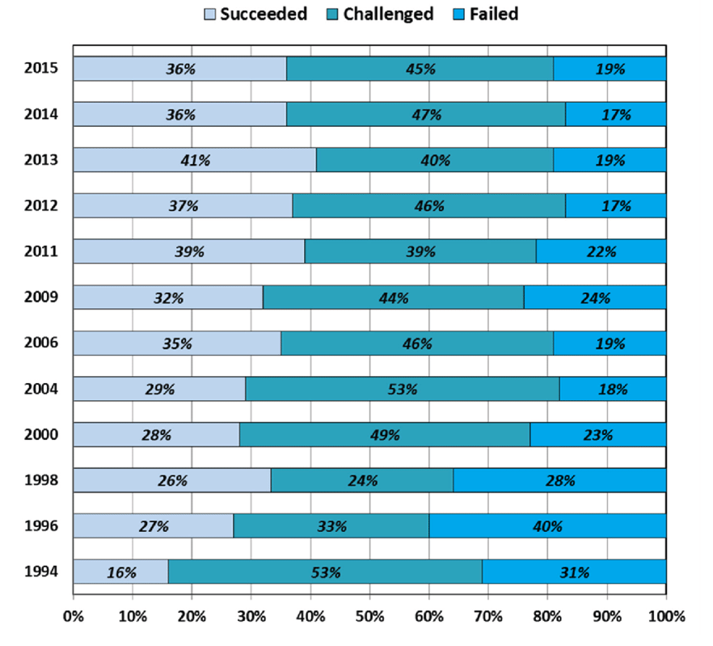

# Aula - 02

## Descrição.

Requisitos de software incluem características desejáveis de um produto, necessidades de um cliente para resolver um problema ou atender a restrições legais e contratuais.

## Resumo.

Por que requisitos são importantes, e o que podem acarretar por mal formulação.

  1. O que acontece quando os requisitos não estão ok ?

    - O sistema pode ser entregue com atraso e com custo além do orçamento.
    - Os clientes e usuários finais podem não ficar satisfeitos com o sistema.
    - Abandono do sistema
    - Reconstruir o sistema.
  2. O sistema pode ficar inviável de ser utilizado devido aos defeitos.

  3. Se o sistema continuar em uso, o custo de manter e evoluir o sistema pode 
  ser muito significativo.

  4. Erros em requisitos acarretam os seguintes problemas.

    - Atraso nas entregas.
    - Baixa qualidade de produtos.
    - Baixa qualidade de vida dos desenvolvedores.
    - Prejuízos de produção.
    - Riscos de morte. (em caso de sistema que atenda a saúde das pessoas.)

  5. Provêm a base para o planejamento do projeto.

  6. Essenciais para estudo de solicitações de mudança.

  7. Permitem a gerência de riscos desde os estágios iniciais de desenvolvimento.

  8. São a base para os testes de aceitação.

  9. Gerenciamento de contratos.

Quando há descoberta de falhas ainda na modelagem de requisitos tende a ser mais baixo o custo para correção e assim nossa operação fica mais barata caso contrário chega a inviabilidade o negocio por questão de:

  - Tempo de desenvolvimento.
  - Custo aplicado na operação para correção ou novas funcionabilidades.
  - Entrega com qualidade.

Existe um relatório na área de software chamado de "relatorio do caos" esse relatorio é uma pesquisa feita no mundo todo que analisa dados de projetos em cursos e finalizados.

Segue abaixo relatorio do caos:

