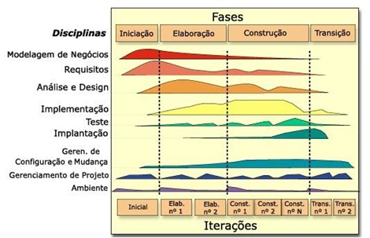

# Aula - 01

## Descrição.

## Resumo.

O que é o RUP ?
  - No Ruop, a arquitetura de software (em um determinado ponto) é a organização ou estrutura dos componentes significativos do sistema que interagem por meio de interfaces,
  com elementos constituídos de componentes e interfaces sucessivamente menores.

**O rup parte da ideia que o desenvolvimento interativo e incremental**

Estilo de arquitetura no RUP
  - Pode ser definido por um conjunto de padrões, ou pela escolha de componentes ou conectores específicos que funcionarão como os tijolos básicos da construção.

O rup utiliza de pequenos ciclos que são:
  - Concepção
  - Elaboracão
  - construção
  - Transição

Grafico do RUP e suas disciplinas.

